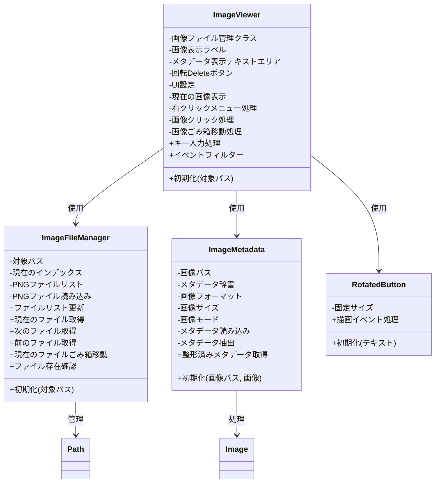

# PNG Viewer

PNG画像ビューアーアプリケーション。SOLID原則とPEP8に準拠した設計で、画像の閲覧とメタデータの表示、検索機能を提供します。

## 機能

- PNG画像の表示とナビゲーション
  - 矢印キー（←→）で画像の切り替え
  - 画像の左右クリックで画像の切り替え
  - DeleteキーまたはDeleteボタンで現在の画像をごみ箱に移動
  - Escキーでアプリケーションを終了
- メタデータの表示
  - ファイル名、フォーマット、サイズ、モード
  - Parameters情報の整形表示
    - Negative Prompt以降を非表示
- 右クリック機能
  - クリックした行のテキストをGoogle画像検索

## システム構成



## 必要条件

- Python 3.8以上
- 必要なパッケージ（requirements.txtに記載）:
  - PyQt6
  - Pillow
  - send2trash

## インストール方法

1. リポジトリをクローン:
```bash
git clone [repository-url]
cd png-viewer
```

2. 仮想環境を作成して有効化:
```bash
python -m venv venv
source venv/bin/activate  # Linuxの場合
venv\Scripts\activate     # Windowsの場合
```

3. 依存パッケージをインストール:
```bash
pip install -r requirements.txt
```

## 使用方法

1. アプリケーションを起動:
```bash
python png_viewer.py <画像ファイルまたはフォルダのパス>
```

2. 操作方法:
   - 左右矢印キー: 画像の切り替え
   - 画像の左右クリック: 画像の切り替え
   - DeleteキーまたはDeleteボタン: 現在の画像をごみ箱に移動
   - Escキー: アプリケーションを終了
   - 右クリック: クリックした行のテキストでGoogle画像検索

## ライセンス

MIT License 